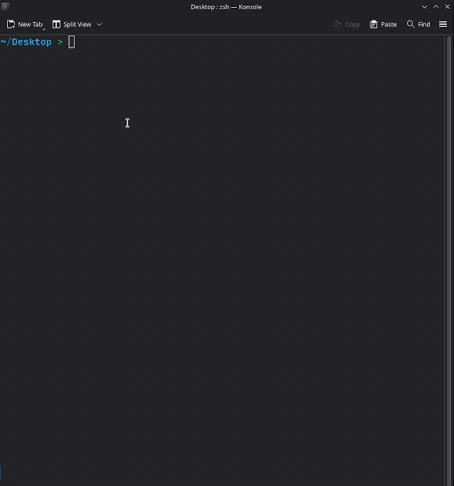

# ccp
(crate: `ccp_tree`)

> 📸 Snapshot · 📋 Blueprint · 🏗️ Scaffold  
> Capture a directory into a portable format and recreate it anywhere.

[](https://crates.io/crates/ccp_tree)
[](LICENSE)

`ccp` is a command‑line tool I built for daily use. It turns a folder into a human‑readable, copy‑paste‑friendly **snapshot**, and that same snapshot back into a real directory tree. Written in Rust 🦀 with a lot of love ❤️.

- 📄 **Snapshot** a project to Markdown (full content + tree) or a concise `.tree` definition.
- 📋 **Blueprint** – a single file that represents your entire project structure and contents.
- 🏗️ **Scaffold** – recreate the layout with a single command; perfect for bootstrapping, sharing ideas, or feeding LLMs full context.

It’s built for quick pasting into chat windows, code reviews, bug reports, and for generating repeatable project templates. Kinda neat actually 😄.

<p align="center">
  
</p>


---

## Features ✨

- 📄 **Markdown output** – full project tree + every file inside fenced code blocks.
- 🌲 **Tree‑only mode** (`--structure`) – just the directory hierarchy and structure.
- 🔁 **Reverse mode** – emit a `.tree` definition that can later be rebuilt.
- 🛠️ **Generate / Create** – turn a `.tree` definition (file, inline, or template) into real files.
- 🧩 **Template system** – bundled templates (Python, …) + custom templates directory.
- 🔍 **Smart ignores** – respects `.gitignore` / `.ignore`, plus a comprehensive default exclude list (node_modules, target, __pycache__, …).
- 📋 **Clipboard support** – optional; copies output directly to the clipboard.
- 🧹 **Flexible filtering** – include hidden files, skip default ignores, add custom glob patterns, limit file size.
- 🎨 **Colored tree preview** – visual inspection with `--dry-run`.

---

## Installation 🚀

### From Crates.io

```bash
cargo install ccp_tree
```

This installs the `ccp` binary.  
To enable clipboard support (optional, works out‑of‑the‑box on most systems):

```bash
cargo install ccp --features clipboard
```

> On Linux, the clipboard feature tries `wl-copy` (Wayland) and `xclip` (X11) first, then falls back to the `arboard` crate. No extra configuration needed. 👍

### From source

```bash
git clone https://github.com/AradPilevarJavid/ccp
cd ccp
cargo build --release
```

The Arch package also installs a generated `ccp(1)` man page. Cargo does not
install man pages, but you can generate one locally with:

```bash
cargo run --release --bin ccp-mangen -- /tmp
man -l /tmp/ccp.1
```

The binary will be at `./target/release/ccp`.

> 💡 Pro‑tip: try `ccp --help`, `ccp reverse --help` and `ccp generate --help` after installation.

---

## Quick Start ⚡

Work from any directory; by default `ccp` scans the current folder.

```bash
ccp                    # full Markdown snapshot → stdout
ccp > snapshot.md      # save to file
ccp -o output.md       # write directly to a file
ccp -s                 # only the folder tree, no contents
ccp --reverse          # output a .tree definition
```

---

## Usage 🧑‍💻

### The fastest way to capture the structure and recreate in one pipe

```bash
ccp reverse | ccp generate -f -q
```

```
ccp [ROOT] [OPTIONS]
ccp reverse [ROOT] [OPTIONS]
ccp generate [ROOT] [OPTIONS]
ccp create [ROOT] [OPTIONS]        # alias for generate
```

### 1. 📸 Snapshot a folder (default)

```bash
ccp                          # scan current directory
ccp /path/to/project -s      # structure only
ccp -r                       # raw file contents only
ccp --reverse                # .tree definition
ccp --reverse --no-content   # .tree definition without file contents
```

### 2. 🔁 Reverse – create a `.tree` template

```bash
ccp reverse                         # current dir
ccp reverse /path/to/project        # specific folder
ccp reverse -o template.tree        # write to file
ccp reverse --no-content            # omit file contents
```

### 3. 🏗️ Generate / Create – materialise a `.tree` definition

```bash
# From a .tree file
ccp generate --input blueprint.tree

# Into a specific folder
ccp generate ./my-new-project --input blueprint.tree

# From a bundled template
ccp create my-project --template python

# From a custom template
ccp generate --template react-component --templates-dir ./templates

# Inline definition (use \n for newlines)
ccp generate --inline "src/
  index.ts: export default {}
  README.md: # Hello"
```

**Overwrite safety:** the command asks before overwriting existing files.  
Use `--force` to skip prompts, and `--quiet` to suppress them entirely.

**Dry‑run** previews the files that would be created, without touching disk:

```bash
ccp generate --dry-run --input blueprint.tree
```

---

## The `.tree` Definition Format 📝

A lightweight, indentation‑based format that describes files and directories.

### Syntax Rules

- Each line is an entry, indented with **two spaces** per level.
- **Directories** end with a trailing `/`.  
  Example: `src/`
- **Files** are just the name.
  Empty files have no extra content marker.
- **Single‑line contents** follow a colon (`:`):  
  `README.md: # My Project`
- **Multi‑line contents** use a pipe `|` after the colon, then indent content lines by **two extra spaces**:  
  ```
  file.txt:|
    line one
    line two
  ```
- **Binary files** or files exceeding `--max-size` are automatically marked:  
  `image.png: <binary file>`  
  `large.csv: <file too large>`

### Example

```
src/
  main.rs: fn main() { println!("Hello"); }
  lib.rs
  utils/
    helpers.rs: |
      pub fn add(a: i32, b: i32) -> i32 {
          a + b
      }
      pub fn sub(a: i32, b: i32) -> i32 {
          a - b
      }
README.md: # My Project
Cargo.toml: |
  [package]
  name = "my-project"
  version = "0.1.0"
```

This definition can be saved as a `.tree` file and reused with `ccp generate`.

---

## Options ⚙️

### Global / `ccp` (snapshot) & `ccp reverse` options
### if you run ccp --help you will see:

| Flag / Option               | Description |
|-----------------------------|-------------|
| `--include-hidden`          | Include dot‑files and dot‑folders. |
| `--no-ignore`               | Ignore `.gitignore` and `.ignore` files. |
| `-a`, `--all`               | Include default‑excluded directories (target, node_modules, …). |
| `-e`, `--exclude <PAT>`     | Exclude additional glob patterns (repeatable). |
| `--max-size <BYTES>`        | Skip files larger than this size (default: 1 MB). |
| `--max-chars <CHARS>`        | Limit the number of characters read from each file (for AI context windows). |
| `--structure`, `-s`         | Output only the directory tree (Markdown). |
| `--raw`, `-r`               | Output raw file contents only; cannot be combined with `-s`. |
| `--reverse`                 | Output in `.tree` definition format. |
| `--no-content`              | Omit file contents in `.tree` output. |
| `--dry-run`                 | Preview the tree (colored) without writing. |
| `--verbose`, `-v`           | Print extra progress info. |
| `--quiet`, `-q`             | Suppress non‑essential output. |
| `-o`, `--output <FILE>`     | Write output to a file instead of stdout. |
| `-c`, `--clipboard`         | Copy output to clipboard (requires the `clipboard` feature). |

### `ccp generate` / `ccp create` options
### if you run ccp create --help you will see:

| Flag / Option                | Description |
|------------------------------|-------------|
| `--input <FILE>`             | Read `.tree` definition from a file. |
| `--template <NAME>`          | Load a built‑in or custom template. |
| `--templates-dir <DIR>`      | Directory for custom templates (default: `templates/`). |
| `--inline <TEXT>`            | Provide the `.tree` definition directly (newlines as `\n`). |
| `--force`                    | Overwrite existing files without asking. |
| `--dry-run`                  | Preview files to be created (colored tree). |
| `--verbose`, `-v`            | Show every file/directory creation event. |
| `--quiet`, `-q`              | Suppress prompts and informational messages. |

### `ccp reverse` option
### if you run ccp reverse --help you will see:

| Flag / Option                | Description |
|------------------------------|-------------|
| `-o`, `--output <FILE>`      | Write output to this file instead of stdout. |
| `-c`, `--clipboard`          | Copy the result to the system clipboard (requires the `clipboard` feature). |
| `--include-hidden`           | Include hidden files and directories. |
| `--no-ignore`                | Do not respect `.gitignore` / `.ignore` files. |
| `-a`, `--all`                | Include default‑excluded directories (like `target`, `node_modules`). |
| `-e`, `--exclude <PAT>`      | Exclude additional glob patterns (repeatable). |
| `--max-size <BYTES>`         | Skip files larger than this size (default: 1 MB). |
| `--max-chars <CHARS>`        | Limit the number of characters read from each file (for AI context windows). |
| `--no-content`               | Omit file contents in the `.tree` output. |
| `--dry-run`                  | Preview the tree (colored) without writing. |
| `--verbose`, `-v`            | Print extra progress info. |
| `--quiet`, `-q`              | Suppress non‑essential output. |

---

## Practical Examples 💡

### 1. Full context for an AI / code review 🤖

```bash
ccp > project-for-ai.md
```

Paste the Markdown into your chat window. The AI sees the exact tree and every file’s content.

### 2. Quick visual scan (similar to ` ccp -s`) 👀

```bash
ccp --dry-run
```

Prints a colored tree without reading file contents – perfect for checking what would be included.

### 3. Create a reusable project template 📁

```bash
ccp reverse -o python-package.tree
```

Share the `.tree` file or commit it to a template repository.

### 4. Bootstrap a new project from a template 🚀

```bash
ccp create my-project --template python
```

### 5. Inline one‑off scaffolding 🧱
#### writing this requires knowing the .tree syntac
```bash
ccp generate --inline "src/
  main.rs: fn main() { println!(\"Hello\"); }
  Cargo.toml: |
    [package]
    name = \"demo\"
    version = \"0.1.0\"
    edition = \"2021\"
"
```

### 6. Exclude logs and artifacts everywhere 🗑️

```bash
ccp -e "*.log" -e "target/"
```

### 7. Snapshot everything (including build dirs) 🌐

```bash
ccp --all > full-snapshot.md
```

### 8. Scan a different folder and output only the tree 🌲

```bash
ccp ../another-project -s -o structure.md
```

---

## Built‑in Templates 📦

`ccp` ships with a few starter templates (bundled at compile time).  
Check the available ones with a non‑existent name:

```bash
ccp generate --template not-a-template  # error message lists all built‑in templates
```

Currently included: `python` (a minimal Python project).  
Add your own by placing `.tree` files into a `templates/` directory next to where you run `ccp`, or specify a path with `--templates-dir`.

The template loader checks:
1. `templates_dir/NAME`
2. `templates_dir/NAME.tree`
3. Built‑in templates (fallback)

So you can override a built‑in template by placing a file with the same name in your custom folder.

---

## Default Exclusions 🧹

To keep snapshots clean and focused, `ccp` skips a large set of common clutter by default.  
The full list is embedded in the source; it includes:

- Build & cache directories: `target/`, `node_modules/`, `dist/`, `build/`, `.next/`, `__pycache__/`, `.cache/`, …
- Version control: `.git/`
- Lock files: `Cargo.lock`, `*.lock`
- IDE / editor: `.idea/`, `.vscode/`, `*.swp`
- OS files: `.DS_Store`, `Thumbs.db`
- Binary archives: `*.zip`, `*.tar.gz`, `*.pdf`, `*.mp4`

Use **`-a` / `--all`** to include everything (except patterns added with `-e`).  
You can also create a `.mktreeignore` file in your project root to add custom ignore patterns (one per line, same syntax as `.gitignore`).

---

## Integration Tips 🔗

- **Piping to clipboard**: `ccp | xclip -selection clipboard` (if not using `-c`).
- **CI / scripts**: use `-q` and `--force` to avoid interactive prompts.
- **Templating engine**: you can pre‑process `.tree` files with environment variables or `sed` before feeding them to `ccp generate`.

---
## Roadmap(TODO)
some of these are already partly done.
- [x] Release on AUR
- [ ] include a line that links user to the repo in the default template.(e.g Hello from ccp check out the project:<repo_link>)
- [ ] add an option that can limit the length of the content.(Sometimes the files are larger than the max input for an ai.)
- [ ] implement a complete tokenizer instead of the current estimate_tokens function(4 chars = 1 token).
- [ ] generate a manual page.(Or a more complete help)
- [ ] be able to point out a specific file to not include
- [ ] Add project statistics (files, directories, lines, size)
- [ ] Estimate LLM token count for generated output
- [ ] Support XML output format
- [ ] Add configuration file support (`.ccprc` / `ccp.toml`)
- [ ] Detect and warn about potential secrets before exporting
- [ ] Support scanning remote Git repositories without cloning manually -> I'm not fully sure if this is a great idea but I might end up making it:)
- [ ] Add Git metadata (branch, commit hash, remote URL) to snapshots
- [ ] Support multiple output formats (`markdown`, `xml`, `json`, `raw`) -> ccp already supports markdown and raw
- [ ] Add summary section to snapshots (statistics + token count)
- [ ] Improve binary file handling with MIME-type detection
- [ ] Add more built‑in templates (Rust, React, Go)
- [ ] Handel files that are too larg (more than 1048576 bytes)
- [ ] Better binary‑file detection and handeling (checksums)
- [ ] Have the name of the project directory when printing the structure (minor change)
- [ ] handel files like gifs


## License 📜

MIT – see [LICENSE](LICENSE).  
Copyright (c) 2026 Arad Pilevar Javid.

---

## Contributing 🤝

Feedback, issues, and pull requests are welcome!  
Make sure to run `cargo test` before submitting.  
If you want to add a new built‑in template, drop a `.tree` file into the `templates/` directory – the build script picks it up automatically.
